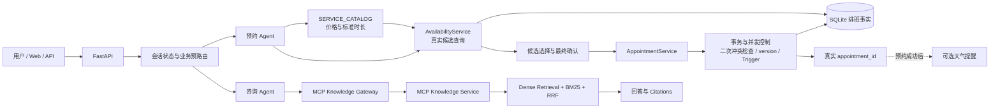

# AI Hair Salon Agent

## 自然语言驱动的理发店预约与知识咨询系统

用户可以直接通过自然语言查询档期、选择发型师，以及创建、查询、取消或修改预约。

系统使用 Agent 理解用户表达并维护多轮对话状态，使用确定性业务服务校验价格、时长、发型师能力、真实排班和预约冲突，最后由 SQLite 保存预约事实。服务知识与护理咨询则通过独立的 MCP 知识服务完成。

> **Agent 负责理解，业务服务负责决策，SQLite 负责保存事实。**

---

## 一分钟项目摘要

传统预约系统通常要求用户按照固定表单逐项选择日期、时间、服务和发型师，但真实用户更可能直接表达：

```text
明天下午找擅长冷棕色的老师
今天下午哪些理发师有空？
周五晚上想染发，预算四百左右
就选刚才第二个
```

这类表达包含相对日期、模糊时段、服务偏好、专长要求和多轮上下文，难以通过单次表单提交或简单关键词判断完整处理。

本项目将自然语言转换为日期、精确时间或时间范围、服务项目、发型师和专长偏好等结构化约束，再通过真实服务目录、发型师资料和 SQLite 排班生成候选。

LLM 不决定标准价格、服务时长、发型师是否有空或预约是否成功。最终预约由 `AppointmentService` 再次校验业务规则，并在数据库事务中同步写入预约和排班。

知识咨询通过独立的 MCP 知识服务完成。知识服务不可用时，咨询接口会明确降级，但预约链路仍然可以独立运行。

当前主分支基线包括：

* 181 个自动化测试；
* Python 3.12 CI；
* 可复现的依赖约束；
* `DeprecationWarning` 严格检查；
* 受保护的 `main` 分支。

---

## 业务背景与核心问题

理发店预约不仅是“选择时间并提交表单”，还包含以下现实问题：

* 用户可能只提供部分信息，需要系统多轮补充；
* “下午”“晚上”等表达代表时间范围，而不是固定时间；
* “冷棕色”“显白发色”等偏好需要映射到服务和专长；
* “第一个”“刚才那个老师”必须结合当前会话理解；
* 用户查询档期时，系统必须读取真实排班，不能由模型猜测；
* 查询候选与最终写入之间可能出现其他用户抢先预约；
* 服务咨询和预约执行需要使用不同的数据来源和可靠性边界。

项目的目标不是单纯增加聊天界面，而是：

1. 降低用户表达和操作成本；
2. 将模糊需求转换为可校验的业务约束；
3. 减少人工反复确认；
4. 统一档期查询、预约生命周期和知识咨询入口；
5. 保证价格、排班、冲突和数据库写入仍由确定性规则控制。

---

## 技术选型：Agent 与确定性流程如何分工

Web 页面、小程序和 API 都可以作为用户入口。Agent 并不替代这些交互载体，而是补充自然语言理解、多轮状态管理和任务协调能力。

本项目也不是用 Agent 替代全部固定流程，而是采用混合架构：

> **Agent 处理输入的不确定性，确定性流程控制输出的确定性。**

| 场景          | 传统表单或固定流程   | Agent           |
| ----------- | ----------- | --------------- |
| 标准字段预约      | 适合          | 不一定需要           |
| 模糊自然语言      | 需要编写大量规则    | 更适合理解多样表达       |
| 多轮信息补充      | 需要维护大量状态分支  | 可以结合 Session 解释 |
| “第一个”“刚才那个” | 单句难以判断      | 可以结合上下文         |
| 服务价格和时长     | 应由业务规则决定    | 不应由 LLM 决定      |
| 真实排班与冲突     | 应查询数据库      | 不应由 LLM 编造      |
| 数据库写入       | 应由事务和业务服务执行 | 不应由 LLM 自由决定    |

系统也没有把所有路由完全交给大模型：

* 活动中的预约状态优先于当前单句分类；
* 查询、取消、修改、候选选择和确认等关键状态由后端保护；
* 高精度规则负责明确的日期、时间和可用性查询；
* LLM 用于处理更开放的分类、槽位提取和自然语言回复。

这样既保留了自然语言交互的灵活性，也避免模型输出直接影响真实业务事实。

---

## 项目逻辑框架



预约链路与咨询链路具有不同职责：

```text
预约链路
自然语言 → 结构化约束 → 真实候选 → 最终确认
→ 业务校验 → 数据库事务 → appointment_id

咨询链路
咨询问题 → MCP Knowledge Gateway → MCP Knowledge Service
→ 混合检索 → 带来源引用的回答
```

---

## 系统架构与职责

### 1. Agent 与多轮对话层

负责：

* 业务意图识别；
* 槽位填充（Slot Filling）；
* 相对日期解析；
* 精确时间与模糊时间范围解析；
* 服务、发型师和专长偏好提取；
* Session 状态维护；
* 候选选择语义；
* 最终确认语义；
* 自然语言回复组织。

不负责：

* 决定标准价格；
* 决定标准服务时长；
* 编造发型师；
* 判断真实排班；
* 判断最终预约冲突；
* 直接写数据库；
* 决定预约是否成功。

### 2. 确定性预约业务层

#### `SERVICE_CATALOG`

服务目录是价格和标准时长的权威来源，例如：

| 服务   |   标准时长 |  标准价格 |
| ---- | -----: | ----: |
| 男士短发 |  45 分钟 |  88 元 |
| 女士剪发 |  60 分钟 | 128 元 |
| 染发   | 150 分钟 | 398 元 |
| 烫发   | 180 分钟 | 468 元 |

模型生成的价格或时长不会覆盖服务目录。

#### `AvailabilityService`

根据以下条件生成真实候选：

* 服务能力；
* 发型师专长；
* 指定发型师；
* 营业时间；
* 完整服务时长；
* SQLite 已有排班；
* 当前时间；
* 稳定候选排序。

该服务不调用 LLM、MCP 或天气服务，也不写数据库。

#### `AppointmentService`

统一负责：

* 创建预约；
* 查询预约；
* 查询单笔预约；
* 取消预约；
* 修改服务；
* 更换发型师；
* 调整日期或时间；
* 所有权、状态和版本校验；
* 最终冲突检查；
* 数据库事务。

Agent 和 API 路由都不直接写预约生命周期数据。

### 3. 数据持久化与并发控制层

系统使用 SQLAlchemy 和 SQLite 保存：

* `stylists`；
* `appointments`；
* `stylist_schedules`。

一致性保护包括：

* SQLite 自增整数预约 ID；
* `BEGIN IMMEDIATE` 写事务；
* 最终写入前的二次冲突检查；
* 预约与排班在同一事务内更新；
* SQLite Trigger 阻止同一发型师出现重叠的 `busy` 排班；
* `version` 乐观并发控制；
* 冲突或异常时完整回滚。

### 4. 基于 MCP 的 RAG 知识咨询层

主项目通过 `MCPKnowledgeGateway` 调用独立的 MCP Knowledge Service。

知识服务内部使用：

* Dense Retrieval（向量检索）；
* BM25 关键词检索；
* RRF（Reciprocal Rank Fusion）结果融合；
* Citations 来源引用。

该链路用于回答：

* 服务知识；
* 门店政策；
* 染后护理；
* 发型建议；
* 常见注意事项。

它不参与：

* 真实排班；
* 服务价格；
* 服务时长；
* 发型师是否有空；
* 预约冲突判断；
* 预约写入；
* 预约是否成功。

---

## 一次预约如何执行

以用户输入为例：

```text
明天下午找擅长冷棕色的老师
```

系统执行过程如下：

1. 将请求识别为 `search_availability`；
2. 把“明天”解析为具体日期；
3. 把“下午”保留为时间范围，而不是擅自转换成固定时间；
4. 将“冷棕色”规范化为染发服务下的专长偏好；
5. 从 `SERVICE_CATALOG` 读取染发的标准时长和价格；
6. `AvailabilityService` 查询支持染发且具备对应专长的发型师；
7. 根据营业时间、完整服务时长和 SQLite 排班过滤候选；
8. 返回真实候选，而不是由 LLM 生成一个发型师；
9. 用户通过序号、姓名或姓名加时间选择候选；
10. 系统展示具体预约信息并请求最终确认；
11. 用户确认后，`AppointmentService` 再次检查服务能力和时间冲突；
12. 在同一事务内写入 `appointments` 和 `stylist_schedules`；
13. 返回真实的 `appointment_id`；
14. 聊天预约成功后，可以附加非阻塞的天气提醒。

系统不会：

* 自动选择第一位可用发型师；
* 在最终确认前写入数据库；
* 将查询阶段的候选视为已占用档期；
* 让 LLM 决定预约是否成功。

---

## 多轮 Session 示例

```text
用户：预约明天
系统：记录日期，继续询问服务和时间

用户：男士短发
系统：从服务目录获得 45 分钟和 88 元，继续询问时间

用户：下午两点
系统：查询明天 14:00 的真实候选

用户：第一个
系统：结合当前 Session 解析候选选择

用户：确认
系统：再次检查冲突，在事务内写入预约和排班
```

“男士短发”“下午两点”“第一个”“确认”单独看都不是完整预约指令，必须结合当前 Session 中保存的活动预约状态解释。

当前聊天会话具有以下设计：

* 不同 Session 使用不同的 Agent 状态；
* 候选只保存在产生它们的 Session 中；
* 同一 Session 的请求通过异步锁串行处理；
* 会话注册表设置容量和过期时间，避免无限增长；
* 浏览器可以显式重置 Session。

当前 Session 状态保存在应用进程内存中，不是 Redis 分布式 Session。应用重启或多实例部署时，需要额外的共享会话存储。

---

## 预约生命周期

预约创建、查询、取消和修改共享同一个 `AppointmentService`。

```text
查询当前调用者的预约
    ↓
选择预约并读取当前 version
    ↓
提交 expected_version 和修改内容
    ↓
最终确认
    ↓
BEGIN IMMEDIATE
    ├── 所有权检查
    ├── 状态检查
    ├── version 检查
    ├── 服务能力检查
    ├── 时间与营业时间检查
    ├── 冲突检查
    ├── 更新 appointments
    └── 更新 stylist_schedules
    ↓
COMMIT 或完整 ROLLBACK
```

取消预约时：

* 不物理删除历史记录；
* 将预约状态更新为 `cancelled`；
* 同步释放对应排班；
* 重复取消会返回稳定结果。

修改预约时：

* 未提供的字段保持不变；
* 如果服务变化，重新计算标准价格和时长；
* 冲突检查会排除预约自身原有排班；
* 修改成功后递增 `version`。

如果客户端提交的 `expected_version` 已过期，系统返回 `stale_state`，而不是静默覆盖较新的修改。

---

## 关键工程难点

### 1. 自然语言转换为结构化约束

系统需要从不同表达中提取：

* `intent`；
* 日期；
* 精确时间；
* 时间范围；
* 服务项目；
* 发型师；
* 专长偏好；
* 候选选择；
* 最终确认。

时间范围和精确时间分别保存，避免把“下午”错误地转换成某个固定开始时间。

### 2. 多轮状态与路由连续性

活动中的预约状态优先于当前单句分类。

例如用户正在选择候选时发送“第一个”，系统不会把它当成新问题；正在等待最终确认时发送“确认”，也不会重新进入普通任务分类。

### 3. 防止 LLM 幻觉影响真实预约

| 业务事实      | 权威来源                          |
| --------- | ----------------------------- |
| 服务、价格和时长  | `SERVICE_CATALOG`             |
| 发型师资料与专长  | 结构化发型师数据                      |
| 已有预约与排班   | SQLite                        |
| 可用候选      | `AvailabilityService`         |
| 冲突检查与预约写入 | `AppointmentService`          |
| 所有权、状态与版本 | `AppointmentService` + SQLite |
| 护理知识和服务政策 | MCP Knowledge Service         |

LLM 的作用是理解和组织，不是替代业务事实来源。

### 4. 查询候选与最终写入之间的并发

用户看到候选后，在最终确认前，其他用户可能已经预约相同时段。

因此系统不会依赖第一次查询结果直接写入，而是在最终确认时重新检查：

* 发型师是否仍存在；
* 是否仍支持该服务；
* 时间是否仍在营业范围内；
* 档期是否仍然空闲。

数据库 Trigger 继续作为最后一道保护。

### 5. 外部服务故障隔离

预约、咨询和天气具有不同故障边界：

* MCP 知识服务不可用时，咨询返回明确的不可用响应；
* 预约服务不依赖 MCP，仍然可以执行；
* 天气服务失败时只省略提醒，不撤销已保存预约；
* 数据库写入失败时不会返回预约成功；
* RAG 检索结果不会覆盖服务目录或排班事实。

---

## 当前能力

| 能力     | 当前实现                              |
| ------ | --------------------------------- |
| 自然语言意图 | 识别预约创建、档期查询、知识咨询及预约生命周期操作         |
| 日期和时间  | 支持相对日期、具体日期、精确时间和模糊时段             |
| 服务目录   | 使用代码中的确定性目录管理服务、价格与标准时长           |
| 专长映射   | 将“冷棕”“冷调棕色”等表达规范化为已支持的专长          |
| 真实档期查询 | 根据发型师能力、营业时间、服务时长和 SQLite 排班生成候选  |
| 候选选择   | 支持序号、姓名和时间表达，歧义时继续追问              |
| 最终确认   | 用户确认后再次检查冲突，再写入数据库                |
| 幂等控制   | 重复确认不会重复创建同一预约                    |
| 预约生命周期 | 支持查询、取消、修改服务、更换发型师和改期             |
| 并发一致性  | 使用事务、二次校验、Trigger 和 version       |
| 知识咨询   | 通过 MCP 调用独立 RAG 知识服务并返回 Citations |
| 故障隔离   | 咨询或天气故障不会改变预约数据库结果                |

---

## 可靠性与工程质量

当前主分支使用以下工程保护：

* Python 3.12；
* 运行依赖与开发依赖分离；
* `constraints-py312.txt` 固定已验证依赖版本；
* `pip check` 检查依赖一致性；
* 181 个自动化测试；
* `DeprecationWarning` 会导致测试失败；
* GitHub Actions 在全新的 Ubuntu 环境重新安装依赖并运行测试；
* `main` 分支要求 `Python 3.12` Check 成功；
* 禁止对 `main` 执行 force push 或删除操作。

本地声称“测试通过”并不足以进入主分支，GitHub CI 会进行独立验证。

---

## 测试与评估结果

### 自动化测试

| 项目       |       当前结果 |
| -------- | ---------: |
| pytest   | 181 passed |
| Failed   |          0 |
| Warnings |          0 |

CI 使用的测试命令：

```bash
python -m pytest -W error::DeprecationWarning
```

### 已验证评估结果

| 指标            |      结果 |
| ------------- | ------: |
| 功能契约评估        | 28 / 28 |
| RAG 用例        |      11 |
| Hit@1         | 10 / 11 |
| Hit@3         | 11 / 11 |
| MRR           |  0.9545 |
| Citation 来源匹配 | 11 / 11 |

当前知识语料包括：

* 7 份源文档；
* 24 个语义切片；
* 24 条向量检索记录；
* 24 条 BM25 检索记录。

这些结果用于当前受控语料下的可复现回归验证，不代表生产环境准确率，也不是通用 Benchmark。

---

## 技术栈

### Web 与 API

* Python 3.12
* FastAPI
* Uvicorn
* Jinja2
* Pydantic

### Agent 与模型调用

* LangChain Core
* LangChain OpenAI
* OpenAI-compatible LLM / Qwen
* 规则预路由与 Session 状态管理

### 业务与数据

* SQLAlchemy
* SQLite
* 确定性服务目录
* 数据库事务与 Trigger
* 乐观并发控制

### 知识咨询

* Official MCP Python SDK
* MCP `ClientSession`
* stdio transport
* Dense Retrieval
* BM25
* RRF
* Citations
* ChromaDB（位于独立 MCP Knowledge Service）

### 工程质量

* pytest
* GitHub Actions
* pip constraints
* main 分支保护

---

## 项目结构

```text
ai-hair-salon-agent/
├── agents/                  # 任务分类、预约、咨询和多轮状态
├── api/                     # FastAPI 业务接口与响应模型
├── services/                # 服务目录、档期、预约和 MCP Gateway
├── db/                      # SQLAlchemy 模型、仓储和 SQLite
├── config/                  # 模型、时间、日志和应用配置
├── web/                     # 聊天、状态与排班页面
├── tests/                   # 单元测试、集成测试和回归测试
├── eval/                    # Golden Dataset 与评估工具
├── docs/                    # 架构、演示与集成文档
├── architecture.svg
├── requirements.txt
├── requirements-dev.txt
├── constraints-py312.txt
└── app.py
```

---

## 快速启动

主要开发、运行和 CI 版本为 Python 3.12。

默认配置关闭外部 MCP 知识服务，可以先启动预约功能和本地页面。

```bash
python3.12 -m venv .venv
source .venv/bin/activate

python -m pip install --upgrade pip
python -m pip install \
  -c constraints-py312.txt \
  -r requirements.txt

cp .env.example .env

python -m uvicorn app:app \
  --host 127.0.0.1 \
  --port 8000
```

常用入口：

* 首页：`http://127.0.0.1:8000`
* Swagger：`http://127.0.0.1:8000/docs`
* 发型师信息：`http://127.0.0.1:8000/stylists`
* 发型师排班：`http://127.0.0.1:8000/stylist-schedule`
* 系统状态：`http://127.0.0.1:8000/status`
* 健康检查：`http://127.0.0.1:8000/health`

---

## 开发与测试

```bash
python3.12 -m venv .venv
source .venv/bin/activate

python -m pip install --upgrade pip
python -m pip install \
  -c constraints-py312.txt \
  -r requirements-dev.txt

python -m pip check
python -m pytest -W error::DeprecationWarning
python -m compileall agents api services db config eval
```

依赖文件职责：

* `requirements.txt`：直接运行依赖及兼容范围；
* `requirements-dev.txt`：开发、测试和评估依赖；
* `constraints-py312.txt`：Python 3.12 下已验证的完整精确版本。

`constraints-py312.txt` 本身不会安装软件，必须与对应的 `-r` 文件一起使用。

---

## 项目边界与后续规划

### 当前已经完成

* 自然语言预约；
* 档期查询；
* 多轮信息补全；
* 候选选择与最终确认；
* 预约查询、取消和修改；
* 事务和并发保护；
* 基于 MCP 的 RAG 知识咨询；
* Citations 来源引用；
* 自动化测试；
* 可复现依赖；
* CI 和主分支保护。

### 当前尚未完成

* 真实用户登录；
* JWT 或 OAuth；
* Redis 分布式 Session；
* PostgreSQL 生产数据库；
* 支付系统；
* 门店员工端；
* 完整的理发师排班管理后台；
* 内部调色配方和药水方案；
* 门店内部 SOP；
* 生产级监控、告警和审计；
* 真实商业流量验证。

当前 `user_id` 或 Session ID 只是调用者范围内的业务所有权标识，用于避免查询或修改其他调用者的预约。

它不是生产级身份认证。

如果进入真实门店部署阶段，优先演进方向为：

```text
认证与授权
→ PostgreSQL
→ Redis Session
→ 可观测性与审计
→ 门店员工端
→ 内部 SOP 与知识体系
```

---

## 详细文档

* [系统架构](docs/ARCHITECTURE.md)
* [演示指南](docs/DEMO_GUIDE.md)
* [评估方法与结果](docs/EVALUATION.md)
* [MCP 知识服务集成](docs/RAG_SERVICE_INTEGRATION.md)
* [独立 MCP Knowledge Service](https://github.com/hyh0620/mcp-knowledge-service)

---

## 项目定位

该项目用于展示以下能力的完整集成：

* 自然语言理解；
* 多轮业务状态；
* Agent 与确定性流程的职责划分；
* 真实排班查询；
* 数据库事务与并发控制；
* 基于 MCP 的外部知识服务集成；
* 带来源引用的 RAG 检索；
* 自动化测试和持续集成。

当前实现重点是验证架构设计、业务边界和端到端流程，不声称已经完成生产部署、拥有真实商业流量或具备未经验证的生产基础设施能力。
